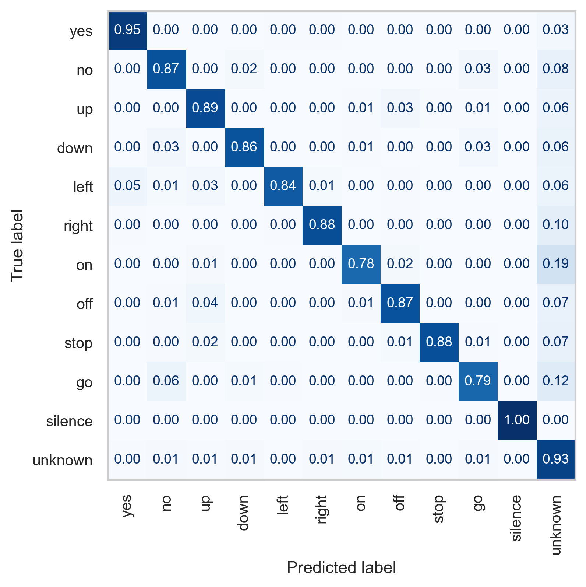

# Deep Learning 2024
Project realized during Deep Learning Summer 2024 course for Data Science @ MiNI

## Project I - Image classification with convolutional neural networks
* [presentation](project1/project1_prez.pdf)
* [report](project1/project1_report.pdf)

## Project II - Audio classification with transformers
* [presentation](project2/project2_prez.pdf)
* [report](project2/project2_report.pdf)

## Project III - Image generation with diffusion models
* [presentation](project3/project3_prez.pdf)
* [report](project3/project3_report.pdf)

